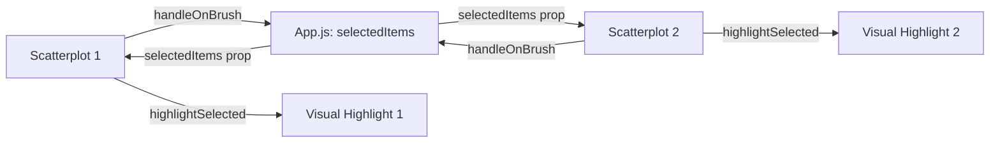

# Synchronized Brushing and Highlighting Architecture

## How It Works

1. **User Interaction:**  
   - The user brushes or clicks to select points in either scatterplot.

2. **Selection Update:**  
   - The scatterplot calls `handleOnBrush`, which uses `scatterplotControllerMethods.updateSelectedItems` to update the selection in `App.js`.

3. **Centralized State:**  
   - `App.js` updates its `selectedItems` state.

4. **Synchronization:**  
   - Both scatterplots receive the new `selectedItems` as a prop.

5. **Highlighting:**  
   - Each scatterplot calls `highlightSelected` to visually highlight the selected points.

## Key Points

- Selection is managed centrally in `App.js`.
- Both scatterplots stay in sync via the shared `selectedItems` prop.
- Brushing or clicking in one plot updates the selection in both.

---

## Design Patterns Used

### React Hooks
- **useState**: Manages selection state (`selectedItems`) in `App.js`.
- **useRef**: Stores references to DOM elements and D3 chart instances for direct manipulation.
- **useEffect**: Handles chart creation, updates, and selection highlighting in response to data or state changes.

### D3 Classes
- Visualization logic is encapsulated in JavaScript classes (e.g., `ScatterplotD3`).
- D3 classes are separated from React components for modularity and clarity.

### Global Update Pattern (D3)
- Uses D3's `selection.join()` (or `enter()`, `exit()`) to efficiently update, add, or remove SVG elements when data changes.
- Ensures smooth rendering and transitions for dynamic data and interactions.

---

These patterns ensure a clean separation of concerns, efficient updates, and maintainable code for interactive, synchronized visualizations.
